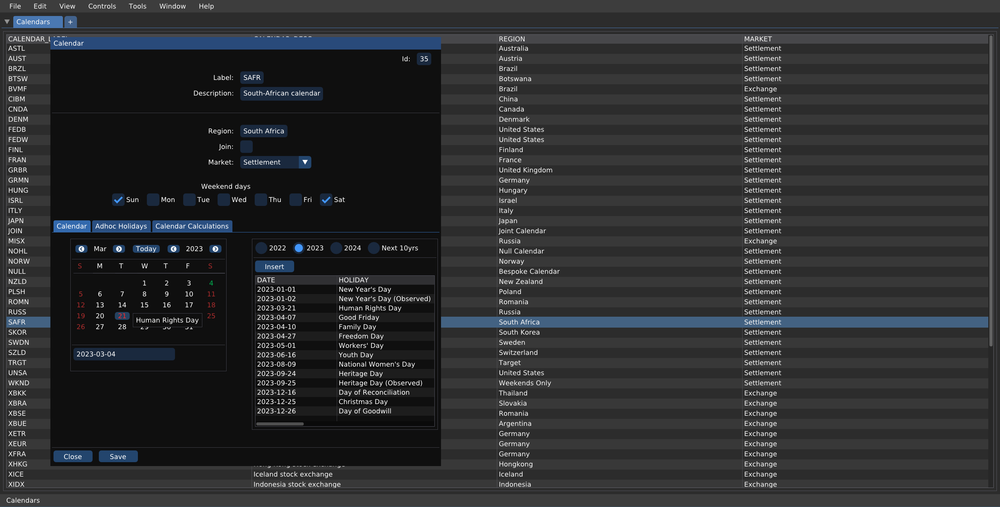
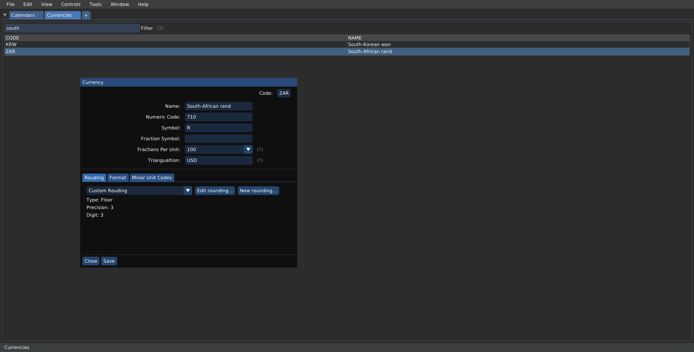

# QuantIO

Quantitative Finance

# Dependencies

- Boost (https://www.boost.org/)
- GLFW (https://www.glfw.org/)
- ImGUI (https://github.com/ocornut/imgui)
- Lua (https://www.lua.org/)
- QuantLib (https://www.quantlib.org/)
- SQLite (https://www.sqlite.org/)

# Screenshots

